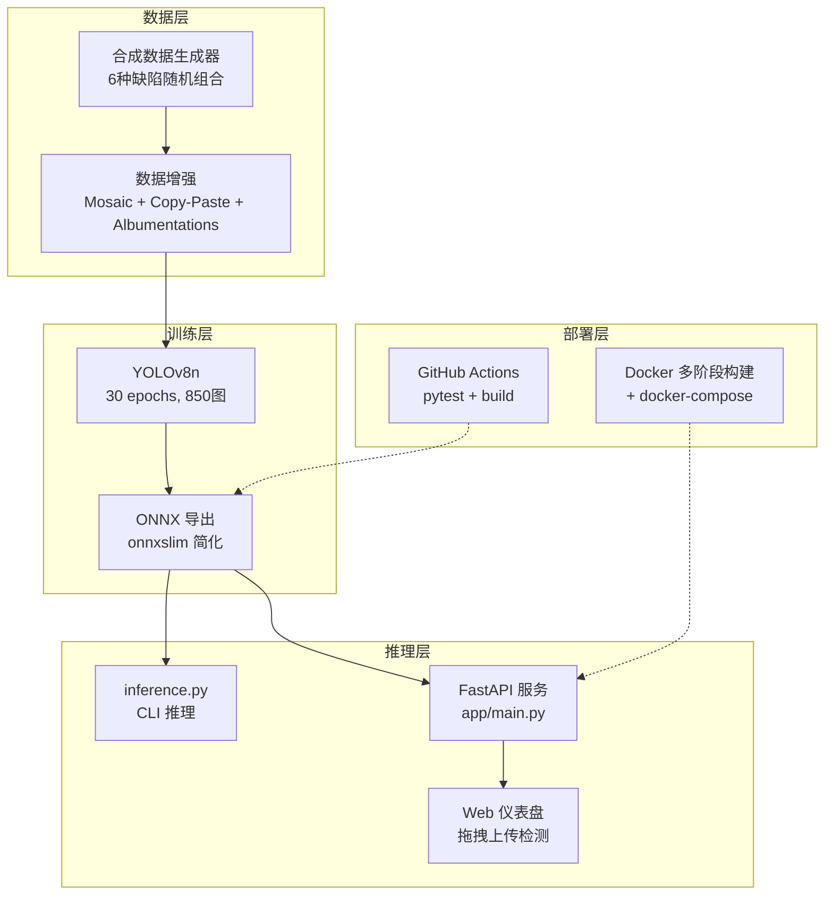
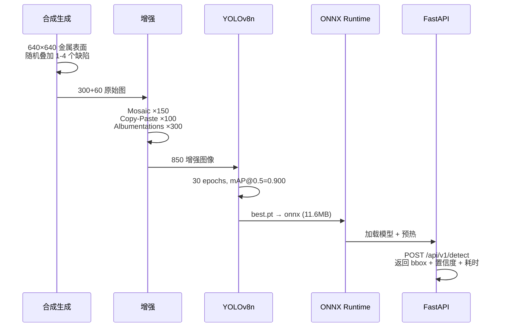

# 工业表面缺陷检测系统

基于 YOLOv8 的金属表面缺陷实时检测系统，支持 6 种典型缺陷的自动识别与定位。完整覆盖数据生成 → 增强 → 训练 → ONNX 导出 → 推理加速 → FastAPI 服务 → Docker 部署全链路。

## 模型指标

| 指标 | 值 |
|------|-----|
| **mAP@0.5** | **0.900** |
| **mAP@0.5:0.95** | **0.674** |
| ONNX 推理速度 | ~7 ms/张 (CPU) |
| 模型大小 | 11.6 MB (ONNX) |
| 测试覆盖率 | 14/14 通过 |

### 各类别精度

| 缺陷 | mAP@0.5 | 说明 |
|------|---------|------|
| scratch 划痕 | 0.995 | 长直线，特征明显 |
| pit 凹坑 | 0.995 | 圆形暗斑，易识别 |
| stain 斑痕 | 0.970 | 小块变色，对比度高 |
| inclusion 夹杂 | 0.925 | 异色斑块 |
| oxidation 氧化皮 | 0.895 | 大面积变色 |
| crack 裂纹 | 0.623 | 细线纹理，160px 分辨率受限 |

> crack 偏低因为在 160×160 低分辨率下细线特征丢失，升到 640×640 可大幅改善。

## 系统架构



## 数据流



## 支持的缺陷类型

| 缺陷 | 英文 | 形态 | 绘制方式 |
|------|------|------|---------|
| 裂纹 | crack | 曲折深色线条 | 随机折线段 |
| 划痕 | scratch | 长直细线 | 随机角度直线 |
| 凹坑 | pit | 圆形暗斑 | 实心圆 + 边缘柔化 |
| 夹杂 | inclusion | 不规则异色斑 | 随机多边形填充 |
| 氧化皮 | oxidation | 大面积变色 | 半透明椭圆叠加 |
| 斑痕 | stain | 小块变色 | 圆 + 不规则边缘加权 |

## 项目结构

```
industrial-defect-detection/
├── app/                            # 企业级应用层
│   ├── main.py                     # FastAPI 入口（lifespan 模型预热）
│   ├── core/
│   │   ├── config.py               # Pydantic Settings（.env 驱动）
│   │   └── logging.py             # Loguru 结构化日志
│   ├── models/
│   │   └── detector.py            # YOLO 检测引擎（支持 ONNX/PT）
│   ├── services/
│   │   └── detector_service.py    # 业务层（单例管理）
│   ├── api/
│   │   └── routes.py              # REST API
│   └── static/
│       └── index.html             # Web 拖拽上传界面
├── config/                         # 训练配置
│   └── settings.py
├── data/
│   ├── synthetic_generator.py     # 合成缺陷生成
│   └── augmentation.py            # Mosaic + Copy-Paste
├── train/
│   └── train.py                   # YOLOv8n 训练
├── export/
│   └── export_onnx.py             # PT → ONNX
├── inference/
│   └── inference.py               # CLI 推理 + 可视化
├── tests/
│   ├── test_detector.py           # 检测器测试 (9项)
│   └── test_api.py                # API 测试 (5项)
├── .github/workflows/ci.yml       # GitHub Actions CI
├── Dockerfile                      # 多阶段构建
├── docker-compose.yml
└── requirements.txt
```

## 快速开始

### 1. 安装

```bash
cd industrial-defect-detection
pip install -r requirements.txt
```

### 2. 启动 API 服务

```bash
python -m uvicorn app.main:app --host 0.0.0.0 --port 8000
```

浏览器打开 `http://localhost:8000`，拖拽图像即可检测。

### 3. API 调用

```bash
# 健康检查
curl http://localhost:8000/api/v1/health

# 检测单张图像
curl -X POST -F "file=@test.jpg" -F "benchmark=true" \
  http://localhost:8000/api/v1/detect
```

返回示例：

```json
{
  "success": true,
  "num_detections": 2,
  "inference_time_ms": 7.3,
  "detections": [
    {"class": "inclusion", "class_zh": "夹杂", "confidence": 0.961,
     "bbox": [183, 284, 242, 341]},
    {"class": "crack", "class_zh": "裂纹", "confidence": 0.554,
     "bbox": [346, 207, 382, 234]}
  ]
}
```

### 4. CLI 推理

```bash
python inference/inference.py data/raw/val/images/defect_0000.jpg
```

### 5. 完整训练流程

```bash
python main.py                          # 数据→增强→训练→导出→推理
python main.py --inference-only <图>   # 仅推理
```

### 6. 运行测试

```bash
pip install -r requirements-dev.txt
pytest tests/ -v    # 14 tests
```

### 7. Docker 部署

```bash
docker compose up -d
# 或
docker build -t defect-detector .
docker run -p 8000:8000 defect-detector
```

## 推理输出示例

```
============================================================
  推理耗时: 7.32 ms (平均 10 次)
  检测到 2 个缺陷:
────────────────────────────────────────────────────────────
  [inclusion   ]  置信度: 0.961  |  bbox: (183, 284) → (242, 341)
  [crack       ]  置信度: 0.554  |  bbox: (346, 207) → (382, 234)
============================================================
```

## 技术栈

| 层级 | 技术 | 说明 |
|------|------|------|
| 深度学习 | PyTorch + YOLOv8 | ultralytics 训练/导出/推理 |
| Web 服务 | FastAPI + uvicorn | REST API + Web 界面 |
| 配置管理 | Pydantic Settings | .env 环境变量驱动 |
| 日志 | Loguru | 结构化日志 + 文件轮转 |
| 推理加速 | ONNX Runtime + onnxslim | CPU ~7ms/张 |
| 数据增强 | Mosaic + Copy-Paste + Albumentations | 300 → 850 张 |
| 测试 | Pytest | 14 项，含 API 集成测试 |
| CI/CD | GitHub Actions | 多 Python 版本测试 + Docker 构建 |
| 部署 | Docker 多阶段 + docker-compose | 非 root 用户 + healthcheck |

## License

MIT
